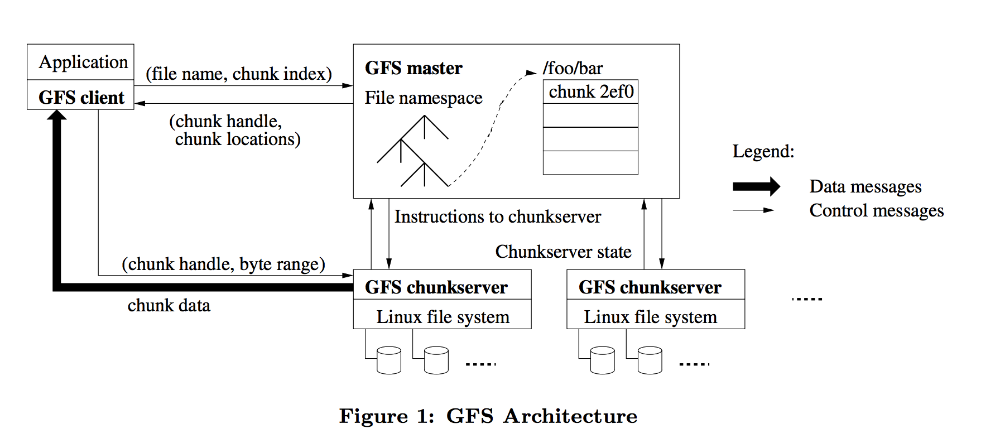
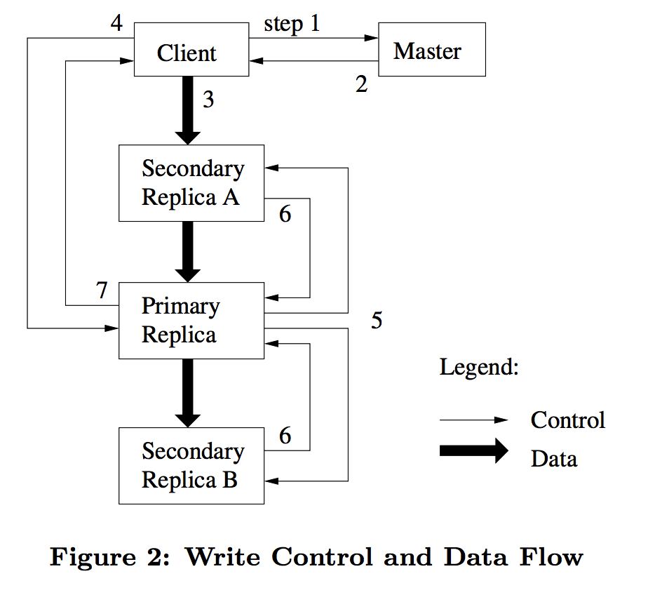

# 分布式系统6.824-GFS(三)
> 即阅读和学习 GFS paper

## GFS
> Google File System

## 概述
GFS是一个可扩展的分布式文件系统, 为大规模分布式数据密集型应用而生. GFS运行在廉价的普通硬件存储上面, 并提供了良好的容错性, 给大量的客户端提供了高聚合的性能.

GFS被广泛的运用在Google中. 大规模的GFS数据集群提供了上千万TB级的存储, 并且支持高并发的访问.

GFS拥有几个主要的特性: __scalability__, __availability__, __rereliability__, __hign performance__, __flexibility__

## 介绍

GFS在设计和实现的过程中有如下几个点需要考虑, 为了支持高并发的操作, 和大规模的存储集群. 

#### 1. 容错(fault-tolerance)

GFS中组件出错是很正常的事情, 而不是异常. 整个GFS存储包含了大量廉价的存储磁盘和机器. 集群机器的数量问题和质量问题可能会导致部分机器不可用或者无法从当前错误中恢复过来. 

除此之外, 诸如,应用程序bug, 操作系统bug, 人为错误, 磁盘损坏, 内存问题, 数据连接, 网络, 电源供应等等. 都是要考虑的因素, 所以, `constant monitoring`, `error detection`, `fault tolerance` `autimatic recovery`等这些功能必须集成到GFS中.
 
#### 2. 块大小 (block size)

按照传统的标准来说, 文件通常是GB级别. 每一个文件通常许多应用的对象, 诸如`WEB document`. 对于GFS来说通常需要管理快速增长的TB级别的数据. 因此如果按照kb级别划分块来管理亿级别数量级的文件,过于笨重. 所以需要重新考虑每一个文件块即`block`的大小, `64MB`是一个比较合适的大小.

#### 3. 追加写 (append)

通常情况下,大部分的文件操作是在原有的文件上面追加新的数据, 而不是重写原有文件. 随机位置对文件的读写基本上不存在. 这些诸如: 数据分析文件(`scan`), 长期不用过时的文件,中间结果文件, 等等. 都是对原有文件进行追加操作, 或者创建新文件进行追加写入操作. 这样就需要设计一种良好的并发支持和原子性保证,以支持特殊情况下客户端错误操作的容错性.

#### 4. 平衡各方面因素 (co-design)

提高了灵活度可以提高API的性能, 但是降低了一致性. 因此需要找到一个平衡点, 原子性追加写可以保证整个GFS的分布式一致性, 但是又需要额外的锁和同步的开销, 分布式锁对于GFS来说是性能上面一个很大的开销. 所以可以舍弃原子性追加写操作, 通过其他方法来实现并发操作, 这样就可以提高性能.

## 设计

### 1. 假设
 
为了设计符合具体需求的GFS, 做出了如下一些假设:
 
+ 整个系统的底层存储由普通廉价硬件组成, 必须保证系统的持续监控, 自我检查, 容错, 和快速恢复.
+ 系统存储着大量GB级别的大文件, 必须对这些文件的操作进行优化.
+ 系统主要包含两种读方式: 大文件流式读, 小文件随机读.
+ 同样的系统包含两种写方式: 大文件流式写, 小文件可以随机写, 随机写不保证高效.
+ 系统必须实现一种定义明确的语义来实现多个客户端对同一个文件进行追加写操作. GFS使用生产者-消费者队列来聚合结果. 用最少的同步开销来保证原子性. 
+ 高可用的带宽比低风险的带宽更加重要.

### 2. 接口

GFS提供了一套类似的文件操作接口, 诸如`create, delete, open, close, read, write`. GFS并没有实现标准POSIX的API. 

GFS提供了`snapshot`和`record append`操作. 快照操作可以用低的开销创建一个文件或者目录树的副本. 记录追加操作(record append)允许多个客户端同时并发的向同一个文件进行`append`操作, 并保证每个独立客户端的追加写操作的原子性. 系统使用生产者-消费者队列来聚合结果, 而不是添加额外的锁.

### 3. 架构

GFS集群包含了一个单一`master`和多个`chunkservers`. 这些`server`都可以被多个客户端同时访问, 可以理解为在普通linux机器上面运行用户级进程.

文件被分割成固定大小的块`chunk`, 每一个块在创建的时候, 就会被`master`执行特殊的函数`chuck handle`来生成一个全局唯一的64位的ID, 用来标识`chuck`. 为了保证`chuck`在分布式系统中的可靠性, 默认的GFS存储3份备份在不同的机器上面, 还可以根据不同的`namespace`来设置不通的备份策略.

`master`存储着所有系统的`metadata`. 这些`metadata`包含了 名字空间`(namespace)`, 权限控制信息`(access control information)`, 文件到块的映射`(mapping from files to chunk)`, 当前块的位置信息, `(current locations of chunks)`. 

`master`控制着整个系统级别的活动. 块租约管理`(chuck lease management)`, 孤儿块垃圾回收 `(garbage collection of orphaned chunks)`, 块在`chunkserver`中迁移 `(chunk migration between chunkserver)`. `master` 定期地使用`HeartBeat`来对每一个`chuckserver`进行状态收集和发送指令. 

GFS客户端代码与`master`进行交互获取`metadata`, 对于数据的操作直接与`chunkserver`进行交流. 

根据上图所示的架构可以看出客户端通过`master`获取关键的数据, 通过`chunkserver`来进进行实际的数据流操作.

### 4. 块大小

块大小是设计整体架构中的一个关键参数. 选择64MB作为块大小, 有如下几个优点. 

+ 比经典的`linux`文件块大很大, 保证了对较大文件操作的高效性
+ 懒惰分配空间避免了浪费空间, 如`(copy on write)`
+ 较大的文件块可以减少与`master`进行通信交互的次数
+ 可以通过TCP长连接来减少网络上面的开销

### 5. 元数据(meatdata)

`master`存储着三个主要类型的元数据:

+ 文件和块的名字空间
+ 文件到块的映射
+ 每一个块和其备份的位置

所有这些元数据都保存在`master`的内存中, `名字空间`和`文件到块的映射`会被`log`操作持久化到本地, 每一个块和其备份的位置不会被持久化, 当`master`启动时, 或者`chunkserver`加入整个GFS集群时, 由`master`主动去轮询每一个`chunkserver`获取其位置.

+ 存储在内存中中, 使得对于`metadata`的操作变得更快.
+ 采用轮询的方式去请求每个块的位置, 相较于采用持久化存储一样简单, 节省了同步的开销. 在处理异常情况下更加鲁棒.
+ 日志操作是至关重要的, 它不仅仅持久化`metadata`而且还记录的并发操作的顺序, 还可以用来记录`checkpoint`和`recovery`

## 系统交互

设计系统时, 需要尽可能简化`master`与`chunkserver`操作, 来达到我们的需求. 

### 1. 租约和修改顺序 `(Leases and Mutation Order)`

`Mutation`: 是指修改`metadata`或者`chunk`块的操作, 诸如写操作, 追加写, 随机写等.   每一个`Mutation`都会在所有`chunk`的副本(备份)上面执行. 使用租约`(Leases)`来维持所有修改`mutation`在所有`chunk`和其副本上面的一致性.  首先`master`将租约赋予`chunk`的某一个备份上面, 这个备份即为`primary`. `primary`串行化所有修改顺序, 依次在`Secondary`和`primary`上面执行. 

如下图为一个基本的写入流程:

1. 客户端首先请求`master`获得当前正在租约的`chunkserver`和其备份的位置, 如果`master`没有相应的租约, 则`master`会新选个租约.
2. `master`回复客户端租约的`primary`和`secondary`的ID.  客户端缓存数据. 
3. 客户端将之前缓存的数据上传到任意的备份服务器上面, 这个顺序可以是任意的. 每个`chunkserver`使用一个LRU数据缓存来存储这些数据, 直到这些数据被使用或者超时. 
4. 当所有的备份服务器都接收到数据之后, 客户端向`primary`发送一个写入请求. 这个请求包含了在备份服务器上之前上传的数据的信息. `primary`将从所有客户端接收的对数据进行的修改操作进行串行化. 之后对该数据进行串行化操作.
5. `primary`将串行化的操作数字, 发送到`secondary`. `secondary`执行同样的操作.
6. `secondary`完成之后通知`primary`已完成.
7. `primary`回复客户端, 任何发生在备份服务器中的错误, 都会被报告给客户端. (如果`primary`出现错误, 则将不会将生成的串行操作序列发送给其他的`secondary`). 如果说客户端收到相应的错误, 则客户端可以编写相应的代码进行相应的重试操作.

### 2. 数据流 `(Data Flow)`
将控制流和数据流分离的主要作用是为了更加高效的利用网络资源. 当控制流从`primary`到`secondary`时, 数据流则会通过线性的传递到所有的`chunkserver`上面. 为了避免
网络带宽资源的瓶颈, 我们需要对数据流的流向进行一个很好的规划. 例如, 未接受到数据流的`chunkserver`的机器可以从最近的一个机器上面获取数据, 即以一种特定的网络拓扑, 这样可以减少弱网络等风险.

### 3. 原子记录追加 `(Atomic Record Appends)`

GFS提供了一个原子追加操作叫做`Record Append`记录追加. 传统的写方法中, 当多个客户端同时并发的对同一个文件进行操作时, 通常是不可串行化的. 

`Record append`被分布式应用中重度使用. __客户端__ 需要提供额外的复杂昂贵的同步机制, 诸如分布式锁. 在GFS中, 使用 __多生产者-单一消费者队列__ 去整合并发操作的结果. 某一个客户端对于文件的一次`Record append`是原子性的.

如果`Record append`在某一备份服务器上面失败了, 则客户端进行重试操作. 在GFS的并发保证中, 定义了每次`Record append`的偏移量, 如果失败了则不会出现重复写入的情况, GFS会对每次写入的情况进行校验, 这样就保证了原子性和一致性.

### 4. 快照 `(Snapshot)`

快照操作是在极短的时间内对文件或者目录进行一次副本的操作, 最小化影响当前正在进行中的修改操作`mutation`. 可以用来快速创建大数据集的一个分支副本, 或者说可以创建检查点这样就可以实现提交和回滚.

和AFS的实现类似, GFS的快照技术使用了标准的写时复制`copy-on-write`. 当`master`接收到一个快照请求时, 首先`master`会注销当前关于该文件所有的未完成的租约`(Lease)`. 所有之后租约的写入操作都会与`master`进行一次交互, 这样就给予了`master`创建一个新的副本的时间, 较少的影响租约操作.

快照操作可以在`chunkserver`的本地创建副本, 这样就可节省网络带宽, 更加快速的完成复制操作.

## Master操作

master 执行所有名字空间的操作, 管理块和副本, 协同系统级别的活动, 回收未使用的存储空间, 负载均衡.

### 1. 名字空间管理和锁 `(Namespace Management and Locking)`

简单的来说就是根据文件的路径前缀加锁, 来达到对特定的区域文件的并发操作, 不影响其他区域的正常操作. 即在前缀名字空间加读锁, 在具体某个操作加具体的锁 `(写操作加写锁, 读操作加读锁)`. 

例如: 对`/d1/d2/d3/leaf`进行写操作, 则对`/d1`, `/d1/d2/`, `/d1/d2/d3`加读锁, 对`/d1/d2/d3/leaf`加写锁.  这样可以提高系统的并发性.

+ 读锁: 可以被多个线程同时请求到, 但是这些线程都不能进行写操作. 读锁和写锁不能同时共存.
+ 写锁: 写锁如果被一个线程请求到, 则其他线程都不能请求该资源. 
+ 读写锁: 即`multipe readers/single-writer lock`. 当发生写操作时, 所有读操作将会被阻塞直到写操作完成.

### 2. 副本放置 `(Replica Placement)`

GFS集群是一个高度的具有层级的分布式系统. 通常来说, GFS集群有上千台机器分布在不同的区域或者机房. 在不同的区域的两台机器进行交互可能会进行很多次网络的转换, 这样的效率会比较低. 

因此, 多级分布式系统需要考虑数据的分布, 来达到可扩展性, 可靠性, 和可用性. 备份副本存放的位置的主要策略是为了两个目的:

+ 最大化数据的可靠性和可用性
+ 最大化利用网络带宽资源

副本的放置需要放置在不同的区域, 这样当一个区域的机器崩溃之后, 其他其余保证了数据的可用性, 和可靠性. 但是写操作通常需要跨不同的区域, 这个代价可以承受.

### 3. 块创建, 再复制, 再平衡 `(Creation, Re-relication, Rebalancing)`

当`master`创建一个`chunk`之后, 需要考虑如下几个因素:

+ 将新创建的`chunk`放置到低于平均磁盘空间占用率的机器上.
+ 限制最近在同一个`chunkserver`上创建`chunk`的数量, 可以平衡在`chunkserver`上面的并发数量

`master`可以再复杂`chunk`, 当块`chunk`的备份数量低于用户定义的目标时. 

`master`会定期的再平衡所有的副本. 会检查当前分布式的副本的负载, 将一部分副本移动到较为合适的位置, 这样就可以实现再次的负载均衡.

### 4. 垃圾回收 `(Garbage Collection)`

当文件被删除之后, `master`将会立刻记录删除操作. 不会立刻回收资源, 这个文件仅仅被重命名为一个隐藏文件包含了删除的时间戳. 当`master`例行遍历文件系统时, 如果此类隐藏文件已经存在了3天`(可以配置的参数)`, 则会删除这些文件. 

`master`在遍历`chunk`的名字空间时, 会识别哪些孤儿`chunk`, 并且擦除这些`chunk`的metadata信息. 在例行的`HeartBeat`消息中, `chunkserver`会向`master`汇报它所有的`chunk`, `master`会向`chunkserver`发送不再使用的`chunk`信息,`chunkserver`则会以很低的代价删除这些`chunk`. 

### 5. 脏备份检测 `(Stale Replica Detection)`

`chunk`备份可能会成为脏块, 如果`chunkserver`奔溃或者丢失了修改`mutation`. 对于每一个`chunk`, `master`维护一个块版本`chunk version number`用来区分最新的块和脏块.

发现了脏块, `master`则会对其进行垃圾回收.

## 高可用性 `(High Availability)`

对于大规模GFS集群, 保证高可用的方法是实现: 快速恢复, 备份

### 1. 快速恢复 `(Fast Recovery)` 

`master`和`chunkserver`都被设计成不管什么原因被终结,都可以在几秒内存储状态和快速的恢复. 进程在被终止之后, 可以很快得读取终止前存储的状态, 并且重新连接服务器重启服务进行重试操作.

### 2. 块备份 `(Chunk Relication)`

块备份通常备份在不同的区域的不同`Chunkserver`上面, 用户可以对不同的名字空间定义不同的备份策略. 

### 3. `master` 备份 `(Master Replication)`

为了提高可靠性, `master`的状态也会被备份. `master`的日志和检查点都会被备份在不同的机器上面. 一次修改`mutation`当被从log缓冲输入到磁盘中时, 可以说提交`commit`了这次修改. 

`master`进程主管着所有修改以及系统后台的一些操作,诸如 垃圾回收等等. 当`master`进程奔溃之后, 可以根据持久化存储的日志和状态, 快速的重启`master`进程. 

当`master`上面的硬件比如磁盘坏掉之后, 外部基础监控会重启一台带有`master`的进程的机器, 可以根据持久化状态和日志恢复之前`master`进程. 使用DNS可以创建链接使得服务可用.

`shadow master`即只读`master`, 该`master`提供了最基础,最低的可用性. 即提供了只读服务, 保证了当`primary master`奔溃之后, 可以保证最低的服务可用. 类似于服务降级. 

`shadow master`和`secondary master`类似, 也会不断的读取日志和操作序列, 并且在启动时, 轮询所有`chunkserver`的状态, 获取所有`chunk`的信息和位置.

## Reference
[GFS paper](https://pdos.csail.mit.edu/6.824/papers/gfs.pdf)