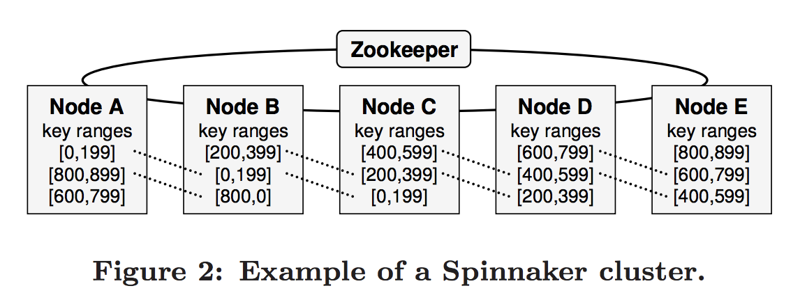
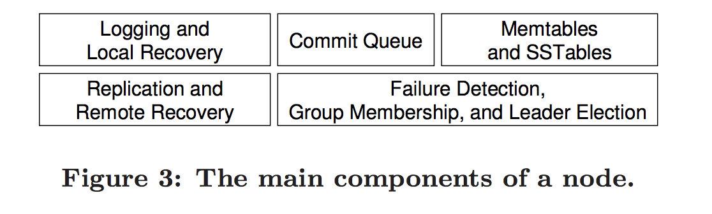
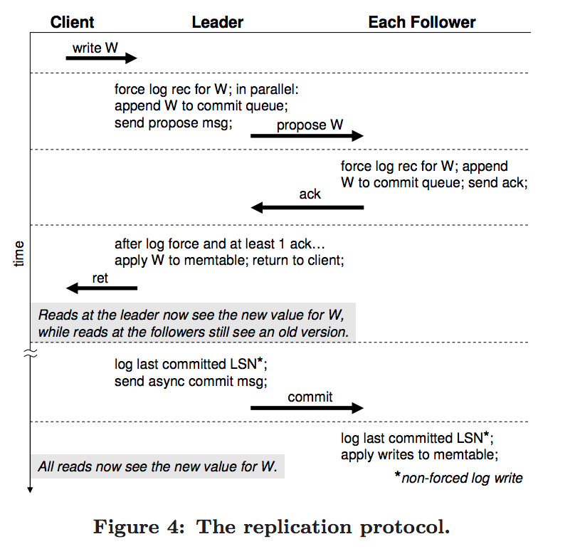

# 分布式系统6.824-Spinnaker(七)
> 即阅读和学习论文 Using paxos to Build a Scalable, Consistent and Highly Available Datastore

## 概述

`Spinnaker`是一个实验性质的数据存储, 运行在数据中心的普通集群机器上面, 有如下几个特点: 

+ 键值分片`key-based range partitioning`
+ 3中方法的备份`3-way replication`
+ 事物型读写API可以选择强一致性或者时间线一致性`transactional get-put API`

`Spinnaker`使用了以paxos为基础的备份协议, 它保证了在集群中有大部分机器没有宕机时, 读写的可用性, 与传统的`Master-slave`不同, 传统的`Master-slave`当大部分机器宕机时, 仍然会执行错误的操作.

## 介绍

### CAP理论

一个分布式系统最多只能同时满足, 一致性(`Consistency`), 可用性(`Availablity`), 分区容错性(`Partition tolerance`)之中的两种.

+ 其中传统的数据库, 通常满足CA, 即`ACID`, `Atomicity, Consistency, Isolation, and Durablility`
+ 分布式NoSQL, 满足PA, 即`BASE`, 即`Basically Available, Soft State, Evental consistency`

### 主备复制的缺点 `Master-Slave Replication`

在传统的主备同步复制策略中`2-way synchronous replication`, 两个节点中的一个节点被指派为`Master`节点, 所有的写操作都会被路由到`Master`节点上面. `Master`先将日志传输到`Salve`上面, 只有当`Salve`保存日志到本地并给`Master`返回成功, `Master`才会强制提交本次操作.

对于特殊情况:

+ 如果`Salve`奔溃了, `Master`可以在没有`Salve`的情况继续正常工作.
+ 如果`Master`奔溃了, `Salve`上面的状态是最新状态, 可以替代`Master`正常工作

`Master-Slave`的同步复制模型可以处理一般情况下的单一节点奔溃. 但是由一个数据库奔溃导致的问题, 往往可以导致发生一系列连续的错误. 即当主备都发生奔溃之后, `Master-Slave`会导致数据的不一致性, 
`Paxos`和`Raft`这种分布式一致性算法可以很好的解决此类问题.

### 强一致性和最终一致性 `Strong vs. Eventual Consistency`

在分布式系统中, 一致性模型描述了不同的`replica`节点之间如何进行同步. 

+ __强一致性__ : 保证了所有对于应用服务的`replica`是相同的, 即状态和数据.
+ __强一致性__ 对于整个软件系统来说是十分重要的, 但是根据`CAP`理论, 即在不牺牲可用性或者数据分片性的情况下是不可能达到强一致性的.

`Dynamo` 使用最终一致性以及高可用性和数据分片在 __跨数据中心的集群__ 上面, 对于最终一致性, `Dynamo`使用向量锁来实现即`vector lock`.

## 数据模型和API

`Spinnaker`的数据模型和api与`BigTable`比较类似. 数据被一行一行的存储, 每一个以其key作为唯一主键进行区分. 每一行数据可以有任何数量的列作为其`corresponding values`. 其中列的名字和值对于`Spinnaker`来说是不可见的字节.

### API

#### 1. `get(key, colname, consistent)`

读取某个`key`对应的某一列的值和其`version`. `consistent`为标志位

+ `consistent`: True 则选择强一致性模型选择最新的一个数据.
+ `consistent`: False 则选择时间线一致性模型`timeline consistency`, 为了更好的性能则有可能会返回一个脏数据.

#### 2. `put(key, colname, colvalue)`

插入某一`key`对应的一个列的k,v

#### 3. `delete(key, colname)`

删除某一`key`对应一个列的看,v

#### 4. `conditionalPut(key, colname, value, v)`

在某一个key对应的行中插入某个新的列, 如果当前行的version等于v则成功, 否则返回错误.

#### 5. `conditionalDelete(key, colname, v)`

类似于`conditional put`

### Version

`version number`是单调递增的整数, 通过`spinnaker`来管理, 并且通过`get`操作获得. `verison number`用在条件插入和条件删除, 提供了对于某一行进行简单方式的读写修改事务. 即相当于使用`version number`优化了并发控制.

## 架构

`Spinnaker`的集群架构和`BigTable`有相似的地方, 对于集群的分割都采用`range partition`.

### 节点结构 `Node Architecture`

`Spinnaker`的`Node`主要由如下几个组件构成. 其中所有的组件都是线程安全的, 并且每个节点上面都有3个`key range`的数据. 	 一个分片的读头部日志可以由指定的logging硬件来处理, 这样可以提高效率. 每个log都被LSN(log sequence number)唯一的确定. 为了共享同样的log, 在同一个节点上面的log使用同一节点的逻辑LSN. `Commit Queue`是一个主要的内存数据结构用来跟踪写的队列. 写操作当接受到logging节点上面的ack有效的信号时, 则该写操作则会被提交. 同时这次提交也会被存储到提交队列中.

注意: `Commit Queue`是在内存中用来记录操作的序号, 不会存储具体log信息

已提交的写操作在`memtable`中, `memtable`的作用是定期的对数据进行排序并且写入不可变的磁盘存储中即`SSTables`的数据结构中. `SSTable`以key和`colunm name`来作为索引, 这样可以提高操作的效率. 在后台小块的`SSTable`将会被合并成大的块, 这样可以提高读的效率. `SStable`的数据结构是以`Big Table`作为设计基础.  

### Zookeeper

`Zookeeper` 被用来处理错误容灾, 和分布式微服务. `Zookeeper`提供了一个中心化的地方去存储`meta data`即配置文件, 并且管理诸如节点奔溃这样的事件. 

`Zookeeper`在设计上面简化的`Spinnker`, 最初`Zookeeper`的设计使得可以很容易的实现分布式锁, 屏障(`barriers`), 以及组关系(`membership`)等.

## 备份协议 `The Replication Protocol`

这一章节描述了`Spinnker`的备份协议, 该备份协议运行在一个集群的机器上面. 具体如下图:

每个备份集群有一个已选出的`leader`和其他两个`follower`, 备份协议有两段组成,分别是: `leader election`和`quorum phase`.

+ `leader election`: 即领导选举
+ `quorum phase`: 即领导向`followers`发出写的请求, `followers`接受并返回`ack`. 在没有失败的情况发生时, 通常只有`quorum phase`执行.

上图表示整个备份协议的具体过程:

+ 1. 首先当客户端要进行写操作时, 根据`key`找到对应的`key-range`, 将此次操作路由到对应的`leader`上面, 然后`leader`节点将写操作放进入`commit queue`, 并且并行的写入本地磁盘, 并向`followers`节点发出写入请求.
+ 2. `followers`接受到了请求的消息, 将log写入本地磁盘, 并且将写操作放入`commit queue`
+ 3. 当`leader`接受到了至少1个节点的`ack`, 则这个时候`leader`将写操作放入`memtable`, 真实有效的提交本次写操作. 持久化本次的log.
+ 4. 最后`leader`返回给客户成功的`response`