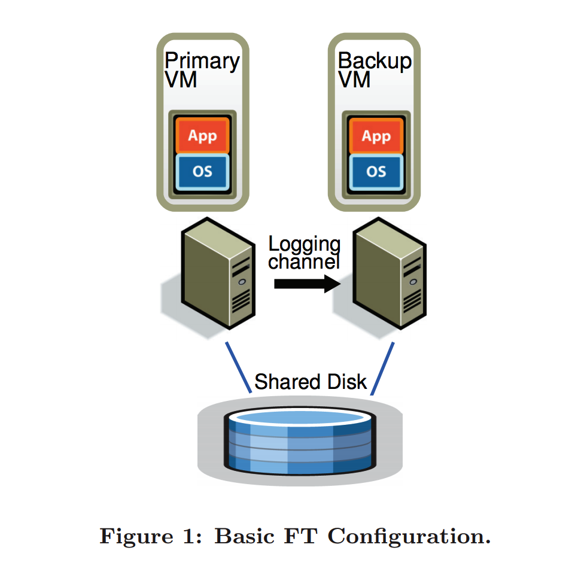

# 分布式系统6.824-主从复制(五)

> 即阅读和学习 FT-VM paper

## 概述
VMWare 通过主从备份实现了商业级高可用虚拟机, 通过将服务备份到另一个服务器上面. 实际运用中以10%的性能损耗少于20M的网络带宽实现主备的可用性. 如下介绍设计细节.

## 介绍

### 基本`Fault-tolerance`模型

> 基本`Fault-tolerance`如下图所示:
 
一主一备. 通过日志来记录相关的操作, 并通过`channal`来传递日志信息. 备份服务总是可用的并且主服务实时的获得备服务的相关信息和状态, 当主服务奔溃之后, 备服务可以立马运作保证了服务的可用性.

对于主从复制有如下几种方法实现:

+ 主通过网络同步发送所有的操作信息, 状态信息, 结果信息, 需要很大的网络带宽.
+ 主和备保证状态的强一致性, 主发送所有的请求操作给备, 但是有一些未确定的因素也需要添加到备中
+ 通过`hypervisor`来监控和管理主备, 通过`Fault-tolerance protocol`来进行主备通信, 使用确定性重现来保证主备一致性

### 确定性重演的实现 `(Deterministic Replay Implementation)`

按照之前提及的, 备份服务器器或者虚拟机可以是确定状态的机器, 即两个确定状态的机器以同样的状态初始化, 给予输入就会得到相同的确定性的输出结果. 

例如, 虚拟机或者实体机器包含了不同的输入, 诸如网络包, 磁盘读, 外设输入等, 还包括了一些其他的中断, 包括时钟中断等等, 这些都会影响到虚拟机的状态. 

日志将会记录所有包含正常操作和可能的不确定操作(中断等), 并将这些操作在合适的操作序列中执行, 保证了机器的确定性. 

## Reference

[FT-VM paper](https://pdos.csail.mit.edu/6.824/papers/vm-ft.pdf)