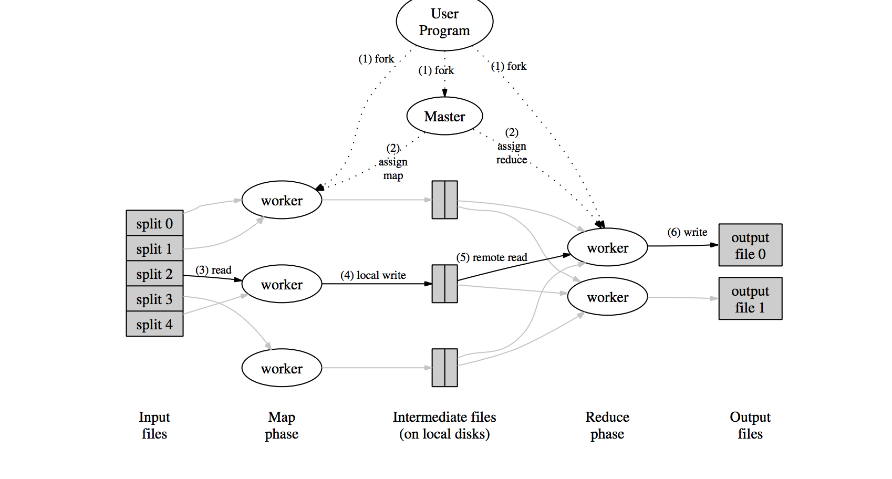

# 分布式系统6.824-入门介绍(一)

## MapReduce
> MapReduce 是一种编程范式, 是由函数式编程模型中的`map`和`reduce`演化而来的.

### 概述

MapReduce: 使用`Map`函数将`key/value`转化成中间结果的`key/value`, `reduce`函数合并所有的中间结果并且与相关的key关联.

函数式的程序可以自动的并且并行的运行在大规模集群上面. 实时运行的整个系统关注于输入数据, 调度任务执行, 处理错误, 管理内部所必须的网络通信等.

### 编程模型

`Map`: 输入`pair`, `kefxiy/value`. 输出中间表示`intermediate key/value`
`Reduce`: 输入中间表示`intermediate key/value`, 输出对应的结果. 输入通常是迭代器, 因为内存中无法存放海量的数据.  

__常见例子:__

+ 统计词频/统计URL: `map`: 对每个单词生成一对`(key, 1)` `reduce`: 将每一对`(key, 1)`合并起来
+ 分布式`Grep`: `map`: 执行grep, `reduce`: 仅仅将每一项`map`的结果进行复制
+ 翻转`web` 链接图: `map`:输入`<source, target>`输出每一个`<target, source>`. `reduce`: 输出`<target, list(source)>`
+ 倒排索引: `map`:输出`<word, document ID>`, `reduce`函数将所有`<word, document ID>`聚合成`<word, list(document ID)>`这样就可跟踪单词在全文中的位置
+ 分布式排序: 

### 运行概述

1. `MapReduce`库在用户程序中首先分割`input files`为M块, 每块为典型的16MB~64MB(通过可选项确定), 然后启动许多`forked`的程序在集群机器上.
2. 这些`forked`的程序其中有一个比较特殊为`Master`程序. 其余程序为`Worker`程序.`Master`程序向`Worker`分配任务. `Master`会选择空闲的`Worker`提交一个`map`任务或者`Reduce`任务
3. 被赋予`Map`任务的的`Worker`会读取`input files`的内容, 到`intermediate key/value`并且存在内存中
4. 内存的中的`key/value`会被定期的写入本地磁盘中, 并且被`partitioning function`划分到不同的区域. 这些在本地磁盘中的`pair`的位置会传回到`Master`,以便后续的`Reduece`函数使用.
5. 当一个`Reduce Worker`获取`Master`通知的之前`intermediate key/value`在磁盘中的位置时. `Reduce Worker`将会通过远程过程调用读取数据. 读取结束之后, 将会根据`intermediate keys`对数据进行排序. 这样以便所有的keys聚集到一起. 如果数据太大无法放进内存, 则使用外部排序.
6. `Reduce Worker`对于每一个不同的`intermediate key`进行计算, 即将`key`和`intermediate values`传入`Reduce Function`. `Reduce Funciton`的结果将会被添加到最终的结果文件中.
7. 当所有`Map`和`Reduce`的任务完成之后, `Master`将会唤醒用户进程. `MapReduce`的调用返回.

### `Master`数据结构
`Master` 保持着许多数据结构. 对于每个`Map`和`Reduce`的任务, 会保留其的状态(空闲, 在进行中, 完成), 和其ID.

`Master`是从`Map task`到`intermediate file`到`Reduce task`的通道. 

### 容错性

由于`MapReduce`是被设计去处理大规模的数据, 运行在大规模分布式集群上面. 所以`MapReduce`需要保持高的容错

#### `Worker Failure`
`Master`会定期的`ping`每个`Worker`, 如果没有在规定的时间内回应, `Master`将会把该`Worker`标记为`failed`. 所有的`map task`被`Woker`完成, `Master`将会把`Worker`的状态标记为空闲(idle), 这样该`Worker`可以重新被调度. 

`map task`在失败的情况下, 需要去重新执行, 因为输出保存在本地磁盘(私有临时文件), 不是全局共享的, 是该机器独有的.

`reduce task`在失败的情况下, 可以不必去重新执行, 输出保存在GFS(global file system)中, 失败之后, 可以重新调度任务, 去执行, 不必在失败的机器上面继续执行.

`map task`可以重复执行, 只有其中的一个`task`会被告知给`Reduce Worker`, 其余的都会被认为失败了. 

`reduce task`如果重复执行了, 多个重复的任务都会写在GFS上面! 

#### `Master Failure`

`Master`会定期的向`Master`的数据结构中写`checkpoints`, 如果`Master`挂了, 则会根据上次的`checkpoints`重新`fork`一个`Master`.

### `Master Locality`文件定位
网络带宽在计算环境中是一种比较稀缺的资源. 通过用`GFS`来管理存储在本地的`input data`来节省网络带宽资源的消耗. `GFS`将每一个文件切分成大小为64MB的块, 并且存储三份备份在不同的机器上. `Master`获取`input files`存储的具体位置信息, 并且在包含相关`input files`的副本的机器上面执行`map task`. 当`map task`失败之后, 则将会在在同一个网络中的另一个`replica`上面重新执行`map task`. 这样在执行一次大规模的`MapReduce`操作时, 大部分`input file`的读操作都是在本地进行, 没有网路带宽资源的消耗.

### `Task Granularity`任务粒度 
将`map`分割为M块, 将`reduce`分割为R块. 理想情况下`M+R>N`, N为`Worker`的数量. 每个`Worker`执行许多不同的任务可以提高动态负载均衡, 并且可以加速出错恢复.

`Master`有`O(M+R)`种调度, 这样必须在内存中存储`O(M*R)`种状态. 通常M的数量为将`input file`分割为16MB-64MB块的数量,  R的数量为期望使用的`Worker`数量的2~5倍.

## Lab实验

### lab `mapreduce` 分析

#### `Master`

存储了所有`Master`需要保存的信息:

+ 互斥量`sync.Mutex`: 对于有共享的数据结构进行并发控制, 即为`workers[]` 实现线程安全
+ 条件变量 `sync.Cond`: 使用了典型的生产者消费者模型, 当有新的`worker`被注册到`master`中去时, `sync.Cond`会调用`boardcast`去唤醒所有等待该条件变量的goroutine.
+ doneChannel: 无缓冲`channel`, 通常可以用来进行线程同步.
+ shutdownChannel

#### `Master.Register`

注册函数. 使用互斥量作为并发控制, 将注册的`worker`添加到`workers[]`中. 通过条件变量, 唤醒`forwardRegistrations`, 即告知有新的`worker`添加.

#### `Master.forwardRegistrations`

注册信息转寄函数, 典型的互斥量与信号量配合使用的方法, 当对信号量进行操作时, (唤醒和等待时, 释放当前的线程的锁, 然后切换线程). 该函数获取`master`中最新添加的`worker`, 并将该`worker`添加到一个特定的`channel`中(非阻塞), `schedule`函数通过`channel`读取`worker`的相关信息, 并消费.

该函数是一个`helper function`, `helper function`是其他函数计算的一部分, 或者说与其他函数的计算流程有关, 通常用来提高程序的可读性. 通过函数的命名可以看出所做事情和与其他函数的关联.

#### `Master.run`

该函数在给定一定数量的`mapper`和`reducer`上面执行`mapreduce`任务.

+ 1. 根据给定数量的`mapper`, 将`input files`切分为若干部分.
+ 2. 在可用或者空闲的`worker`上面调度任务.
+ 3. 当所有的`mapper`任务结束, 就开始执行`reducer`的任务.
+ 4. 当所有的`task`都结束时, `reducer`的结果将会被聚合

该函数, 接收一个`schuedule func(phase jobPhase)` 类型的调度函数, 用来实际执行特定的`mapper`或者`reducer`的任务.

该函数, 接收一个`finish func()`类型的函数, 用来处理调度完成之后的事项.

#### `Worker`

存储了所有与`Worker`相关的一些状态信息

+ 互斥量`sync.Mutex`: 对于共享的数据进行并发控制保证安全性.
+ Map/Reduce: 函数类型

#### `Worker.DoTask`
该函数由`Master`调用, 当有一个新的`task`被`scheduled`时.

+ 使用`mutex`锁机制, 将`worker`的`concurrent`变量+1.
+ 执行`Map`或`Reduce`操作
+ 使用`mutex`锁机制, 将`worker`的`concurrent`变量-1.

#### `Worker.register`
该函数告诉`Master`当前`Worker`存在并且可以调用. 该函数内部调用了`RPC`, 服务.

#### `Worker.RunWorker`
该函数设置`Worker`与`Master`的连接, 并且将该`Worker`的地址还有其他信息注册到`Master`中, 等待`task`的调度.

### part1: `Map/Reduce` input and output
主要编写两个函数, `doMap`和`doReduce`. 

#### `doMap`函数

该函数用来管理一个`map`任务: 读取`input files`中的一个文件, 对于读取的内容执行用户定义的`mapF`, 并且将这个内容切分成`nReduce`个中间文件.

#### `doReduce`

该函数用来管理一个`reduce`任务: 读取中间文件, `key/value` pairs. 先对于中间文件中的`key/value`进行排序, 然后再调用用户定义的`reduceF`, 将结果输出到磁盘上.

### part2: `Single-worker` word count
主要编写`mapF`和`reduceF`, 具体可以参考`mapreduce`的paper实现.

### part3:  Distributing MapReduce tasks
实现一个并行`worker`线程的`MapReduce`通过`rpc`来进行通信. 注意对于`worker`的调度的方法, 可以通过实现线程安全的队列来实现, 即使用经典的`Mutex/Cond`模型. 或者使用`Golang Channel`来实现调度.

### part4: Handing worker failures

实现`master`处理`failed worker`的功能. 由于`worker`没有持久的状态, 如果一个`worker`失败了, 则`master`将会通过`RPC`重新将失败的任务赋给其他的`worker`. 

`worker`失败最主要有如下两种状态:

+ `worker`已经执行了任务,但是`reply`丢失
+ `worker`正在执行任务, 但是rpc超时.

简单的来说就是实现一个错误重试机制.

### part5: Inverted index generation

通过编写`Map`和`Reduce`函数, 来实现构造一个倒排索引. 倒排索引被广泛的运用在文档搜索上面.

主要编写两个函数:

+ `mapFunction`: 将文档中的每个单词构造 `<word, document ID>`的kv对.
+ `reduceFunction`: 接收所有构造的`<word, document ID>`的kv对, 并根据`document ID`进行排序,构造`<word, list(document ID)>`的对. 

## 总结

lab1 花了挺多时间, 熟悉学习了golang的代码设计, 以及rpc相关知识, 不得不说MapReduce论文的思想确实十分伟大. lab1的实现简单但是需要思考很多问题, 收货颇丰!

## Reference

[MapReduce简介](http://airekans.github.io/cloud-computing/2014/01/25/mapreduce-intro)

[google MapReduce papers](https://pdos.csail.mit.edu/6.824/papers/mapreduce.pdf)

[go rpc教程](https://parthdesai.me/articles/2016/05/20/go-rpc-server/)

[go pipeline](https://blog.golang.org/pipelines)